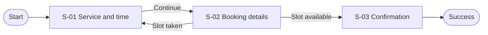

# Progressive Prototype: QuickBook Appointment

> Status: Example | Language: English | Last updated: 2026-07-19

## 1. Product Snapshot

| Item | Definition |
|---|---|
| Primary user | A customer booking a local service on mobile |
| Problem | Calling a business to find an available time is slow and uncertain |
| Intended outcome | Book a suitable appointment with a clear confirmation in under two minutes |
| Success signal | A customer reaches confirmation without staff assistance |

## 2. Scope and Assumptions

### Must have

- Select a service and an available time.
- Enter contact details and confirm the booking.
- Recover when a selected time becomes unavailable.

### Non-goals

- Staff calendar management, payment, accounts, and loyalty programs.

### Constraints

- Mobile-first and usable without signing in.

### Assumptions and open decisions

| ID | Type | Statement | Status |
|---|---|---|---|
| D-01 | Assumption | The business can hold a selected slot for five minutes | Open |
| D-02 | Decision | Whether phone or email is the required confirmation channel | Open |

## 3. Experience Map

| Stage | User intent | Related flows |
|---|---|---|
| Choose | Find the right service and time | F-01 |
| Confirm | Provide contact details and secure the slot | F-01 |
| Recover | Pick another time if availability changes | F-01 |

## 4. User Flows

### F-01 Book an appointment



## 5. Screen Inventory

| ID | Screen | Purpose | Entry | Primary action | Relevant states | Fidelity |
|---|---|---|---|---|---|---|
| S-01 | Service and time | Choose a bookable option | F-01 start or recovery | Continue | loading, empty, error, selected | detailed |
| S-02 | Booking details | Identify the customer and verify the slot | S-01 | Confirm booking | default, validation, submitting, slot-taken | detailed |
| S-03 | Confirmation | Prove that the appointment exists | S-02 | Add to calendar | success | deferred |

## 6. Detailed Screens

### S-01 Service and time

**Decision being tested:** Can the user compare service duration and availability without navigating between pages?

```text
+--------------------------------------------------+
| Book an appointment                              |
| [Service v]                                      |
| Duration and price summary                       |
|                                                  |
| < Previous day   Tue 21 Jul   Next day >         |
| [09:00] [10:30] [13:00] [15:30]                 |
|                                                  |
| Selected: 10:30                                  |
|                                      [Continue]  |
+--------------------------------------------------+
```

**Annotations**

1. Changing service refreshes availability without losing the chosen date.
2. Unavailable times are omitted rather than shown as tappable controls.

**Actions and outcomes**

| Action | Result |
|---|---|
| Select an available time and continue | Open S-02 with the slot held |
| Retry after availability error | Reload S-01 availability |

**Rules and deferred detail**

- Visual styling and final service descriptions are deferred.

### S-02 Booking details

**Decision being tested:** Can the user understand why contact information is required without being forced to create an account?

```text
+--------------------------------------------------+
| Your booking                                     |
| Service · Tue 21 Jul · 10:30            [Change] |
|                                                  |
| Name  [_______________________________]          |
| Phone [_______________________________]          |
| We use this only for booking updates.            |
|                                                  |
|                                  [Confirm]       |
+--------------------------------------------------+
```

**Annotations**

1. The selected slot remains visible and editable.
2. Inline validation appears after field blur and on submission.

**Actions and outcomes**

| Action | Result |
|---|---|
| Confirm while slot is available | Open S-03 |
| Confirm after slot expires | Return to S-01 with a recovery message |

**Rules and deferred detail**

- Consent copy and regional phone formatting are deferred pending D-02.

## 7. State Coverage

| Screen | Loading | Empty | Error | Permission | Recovery | Success |
|---|---|---|---|---|---|---|
| S-01 | Required | Required | Required | N/A | Required | Required |
| S-02 | Required | N/A | Required | N/A | Required | Required |
| S-03 | N/A | N/A | N/A | N/A | N/A | Required |

## 8. Decisions and Change Impact

### Open decisions

| ID | Decision | Why it matters | Owner/next step |
|---|---|---|---|
| D-01 | Confirm the slot-hold duration | Controls expiry and recovery behavior | Validate with scheduling API owner |
| D-02 | Choose the required contact channel | Changes validation and confirmation delivery | Product decision |

### Resolved decisions

| ID | Resolution | Reason |
|---|---|---|
| D-03 | Guest booking is allowed | Account creation is outside the core booking outcome |

### Change impact

| Date | Request | Affected IDs | Conflicts resolved | Follow-up |
|---|---|---|---|---|
| 2026-07-19 | Establish initial example | F-01, S-01, S-02, S-03 | Guest booking removed account dependency | Resolve D-01 and D-02 |

### Visual outputs

| Target | Location | Status/version | Detailed screens | Updated |
|---|---|---|---|---|
| Document | ./PROTOTYPE.md | v0.2 example | S-01, S-02 | 2026-07-19 |
