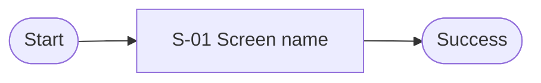

# Progressive Prototype: [Product name]

> Status: Draft | Language: [language] | Last updated: YYYY-MM-DD

## 1. Product Snapshot

| Item | Definition |
|---|---|
| Primary user | |
| Problem | |
| Intended outcome | |
| Success signal | |

## 2. Scope and Assumptions

### Must have

-

### Non-goals

-

### Constraints

-

### Assumptions and open decisions

| ID | Type | Statement | Status |
|---|---|---|---|
| D-01 | Assumption | | Open |

## 3. Experience Map

| Stage | User intent | Related flows |
|---|---|---|
| | | F-01 |

## 4. User Flows

### F-01 [Core flow name]



## 5. Screen Inventory

| ID | Screen | Purpose | Entry | Primary action | Relevant states | Fidelity |
|---|---|---|---|---|---|---|
| S-01 | | | F-01 | | default | outline |

## 6. Detailed Screens

### S-01 [Screen name]

**Decision being tested:**

The wireframe below may contain only text that the end user should see. Keep explanations and rules outside it.

```text
+--------------------------------------------------+
| [Page title]                                     |
+--------------------------------------------------+
| [Primary content]                                |
|                                                  |
|                               [Primary action]   |
+--------------------------------------------------+
```

**Interaction notes — outside the screen**

| ID | Trigger | Condition | Result | Failure/recovery |
|---|---|---|---|---|
| I-01 | | | | |

**Rules and deferred detail**

-

## 7. State Coverage

| Screen | Loading | Empty | Error | Permission | Recovery | Success |
|---|---|---|---|---|---|---|
| S-01 | N/A | N/A | Required | N/A | Required | Required |

## 8. Decisions and Change Impact

### Open decisions

| ID | Decision | Why it matters | Owner/next step |
|---|---|---|---|
| D-01 | | | |

### Resolved decisions

| ID | Resolution | Reason |
|---|---|---|

### Change impact

| Date | Request | Affected IDs | Conflicts resolved | Follow-up |
|---|---|---|---|---|

### Logic audit

| Flow | Reachable start | Success/end | Branch coverage | Failure/recovery | Non-terminal dead ends | Result |
|---|---|---|---|---|---|---|
| F-01 | Pending | Pending | Pending | Pending | Pending | Pending |

### Presentation audit

| Check | Result | Evidence |
|---|---|---|
| User-visible copy only inside screens | Pending | |
| All screens and states tiled | Pending | |
| Interaction notes outside screens | Pending | |

### Visual outputs

| Target | Location | Status/version | Detailed screens | Updated |
|---|---|---|---|---|
| Document | ./PROTOTYPE.md | Current | S-01 | YYYY-MM-DD |
